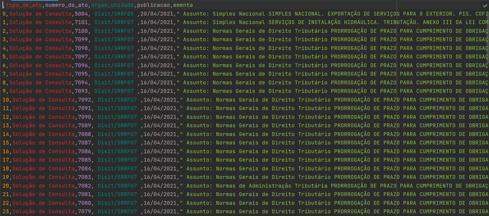
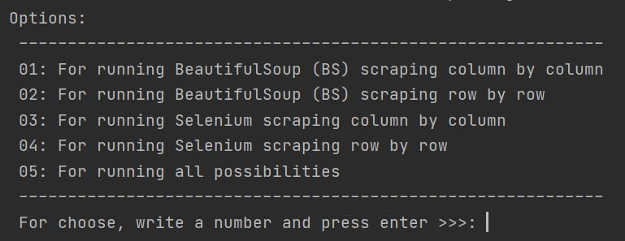

# Tax-Instruction-Scrap
## 💻 About this project (sobre este projeto)
:us: This project aimed to scrap the public Answer to Advance from the Brazilian Federal Revenue Office website, and salve them in a CSV file.

:brazil: Este projeto teve por objetivo obter as soluções de consultas públicas no site da Receita Federal do Brasil, e salvá-las em um documento CSV.

---
## ⚙️ Project demonstration (demontração do projeto)
The algorithm scraps the public Answer to Advance from the Brazilian Federal Revenue Office website, and salve them in a CSV file.

<p align="center"> 

On this project, using BeautifulSoup (BS) or Selenium packages, I developed four different scripts to scrap, so I would be able to compare their efficiency.
The options available are:

<p align="center"> 

The result is interesting:
* Running BS scraping row by row is more efficient than using BS scraping column by column;
* Both are more efficient than using Selenium. In this case, running Selenium to scrap row by row is more efficient than using Selenium to scrap column by column.

The runnig time for each option is shown bellow:

- time_running_BS_by_row:  0:00:00.033499
- time_running_BS_by_column:  0:00:00.059463
- time_running_selenium_by_row:  0:00:49.721204
- time_running_selenium_by_column:  0:00:53.147911

Finally, an example of data scraped can be seen here: [rfb_data.csv](./rfb_data.csv)

---
	
## 💡 Knowledge acquired (conhecimentos adquiridos)

- During this project, I learned:
  - pending to be written;
  - pending to be written; and
  - pending to be written.

---

## 🚀 How to execute this project (como executar este projeto)

 - To run the code it is recommended to use an IDE, such as Pycharm;
  - Just clone this project, open on your IDE, and run.

### 🎲 Requirements (requisitos)

To run the code, it is recommended to install the following Python Packaged:
beautifulsoup4==4.9.3
bs4==0.0.1
certifi==2020.12.5
chardet==4.0.0
idna==2.10
numpy==1.20.2
pandas==1.2.4
python-dateutil==2.8.1
pytz==2021.1
requests==2.25.1
selenium==3.141.0
six==1.15.0
soupsieve==2.2.1
urllib3==1.26.4


#### Running the codes (rodando os códigos)

```bash

# Clone this repository
$ git@github.com:rosadigital/Tax-Instruction-Scrap.git
# Open the repository on pycharm

```

---

## 🦸 Author (autor)


Felipe Rosa on [LinkedIn](https://www.linkedin.com/in/felipe-rosa/)

---

## 📝 License (licença)

This project is licensed under [MIT](./LICENSE).

Este projeto esta sobe a licença [MIT](./LICENSE).

Made with ❤️ by Felipe Rosa 👋🏽 [Contact here!](https://www.linkedin.com/in/felipe-rosa/)

Feito com ❤️ por Felipe Rosa 👋🏽 [Entre em contato!](https://www.linkedin.com/in/felipe-rosa/)

--
